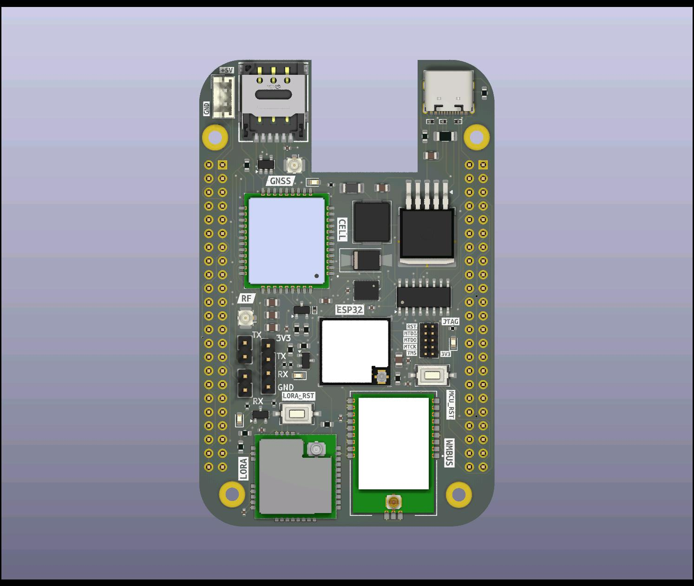

# s0-docs
Documentation for S0 gateway
# 📡 IoT Gateway for Wireless and Wired M-Bus Metering
### 📟 Block Diagram

This project involves the design and development of a robust and modular **IoT Gateway** for smart metering applications. The gateway is capable of collecting data from both **Wireless M-Bus (wMBus)** and **wired M-Bus** utility meters, and transmitting the collected data securely to a remote IoT platform over the internet.

---

## 🚀 Overview

The IoT Gateway is built around the **ESP32-C6** microcontroller, leveraging its RISC-V core and integrated wireless capabilities. It supports both **wireless and wired M-Bus protocols**, commonly used in heat, water, and gas meters for energy monitoring in industrial and residential environments.

The gateway provides support for the following communication interfaces:

- 📶 **Wireless M-Bus (868 MHz)** via the **RC-S2LP module**
- 🔌 **Wired M-Bus** via onboard bus driver circuitry
- 🌐 **NB-IoT / LTE-M** via the **SIM7080G** module for cellular connectivity
- 📡 **LoRa (868 MHz)** via the **RAK3172** module for long-range, low-power communication
- 🌍 **Internet connectivity** via NB-IoT, Ethernet (optional), or LoRaWAN (via backend gateway)

---

## 🔧 Hardware Architecture

The custom PCB integrates multiple communication modules and power interfaces designed for industrial deployment:

| Component       | Description                                 |
|----------------|---------------------------------------------|
| ESP32-C6       | Main microcontroller (RISC-V, WiFi, BLE)    |
| RC-S2LP        | Wireless M-Bus 868 MHz transceiver           |
| RAK3172        | LoRa module (868 MHz)                        |
| SIM7080G       | NB-IoT/LTE-M module                          |
| Wired M-Bus    | Driver interface for traditional M-Bus meters |
| Ethernet       | (Optional) for local network connectivity    |
| USB-C & Terminals | For power and debug                       |
| GNSS Support   | Optional via SIM7080G for asset tracking     |

The board is compact and optimized for IP-rated DIN-rail enclosures for industrial/outdoor environments. It features side-mounted SMA connectors for each antenna (WiFi, GNSS, LoRa, NB-IoT, wMBus).

---

## 🌐 Software Functionality

The gateway firmware performs the following functions:

- Collects meter data periodically from both wired and wireless M-Bus meters.
- Transmits structured data securely to, Magistrala a remote IoT platform via MQTT.
- Manages reconnections and retry logic for unreliable NB-IoT networks.
- Logs diagnostics and status via UART or remote logging service.

---

## 📦 Repository Contents

