# 📡 S0 Board Architecture and Schematics

## **HARDWARE ARCHITECTURE**

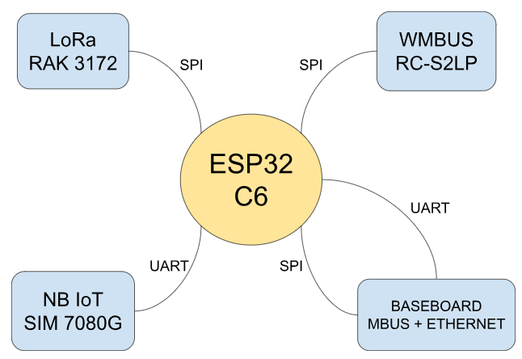

### **ESP32 CIRCUIT**

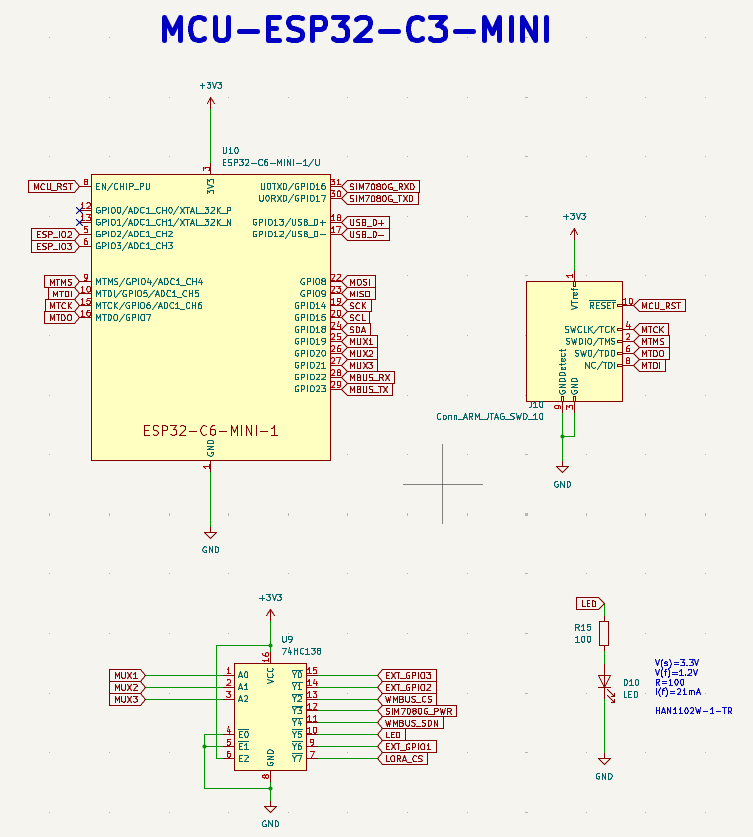

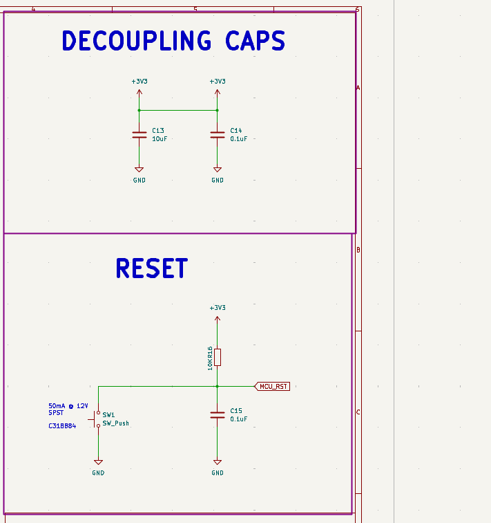

### **SIM7080G CIRCUIT**

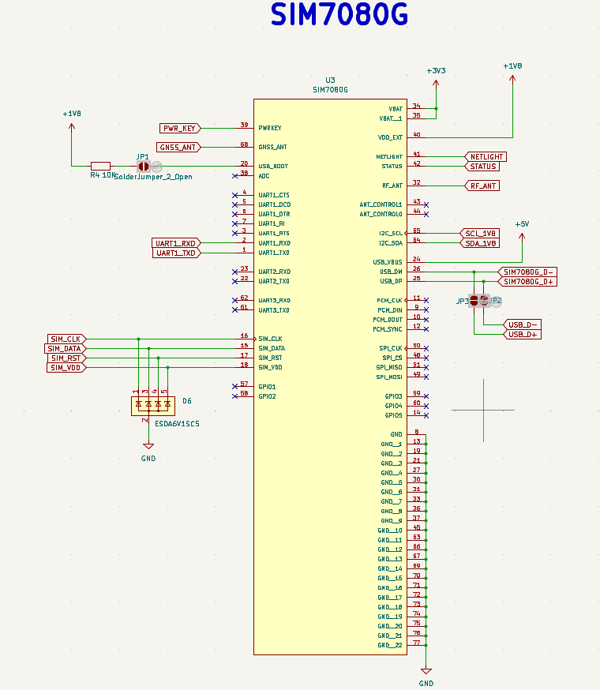

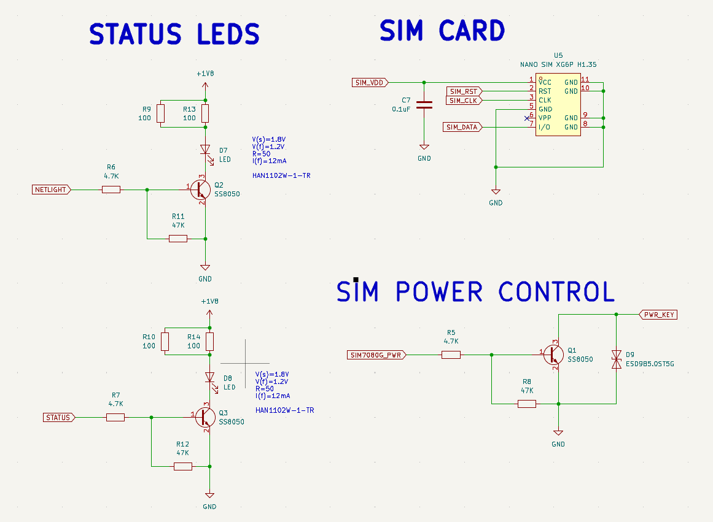

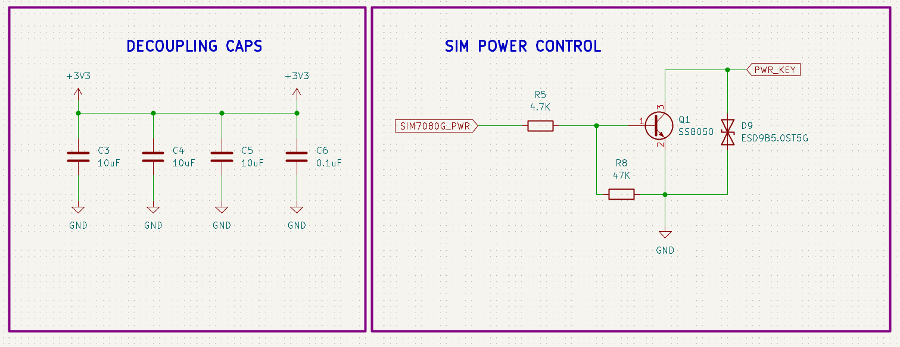

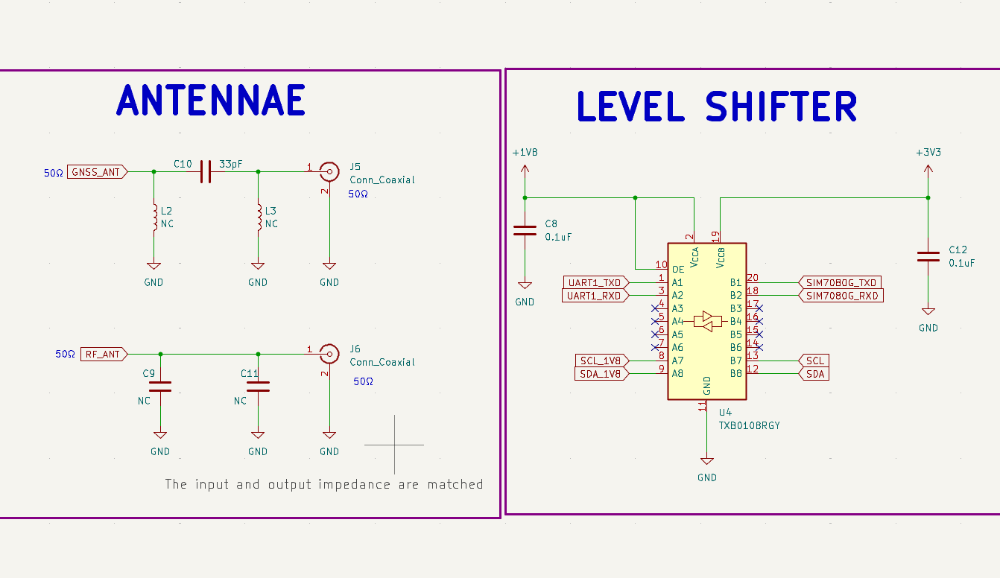

### **RAK 3172 LORA MODULE**

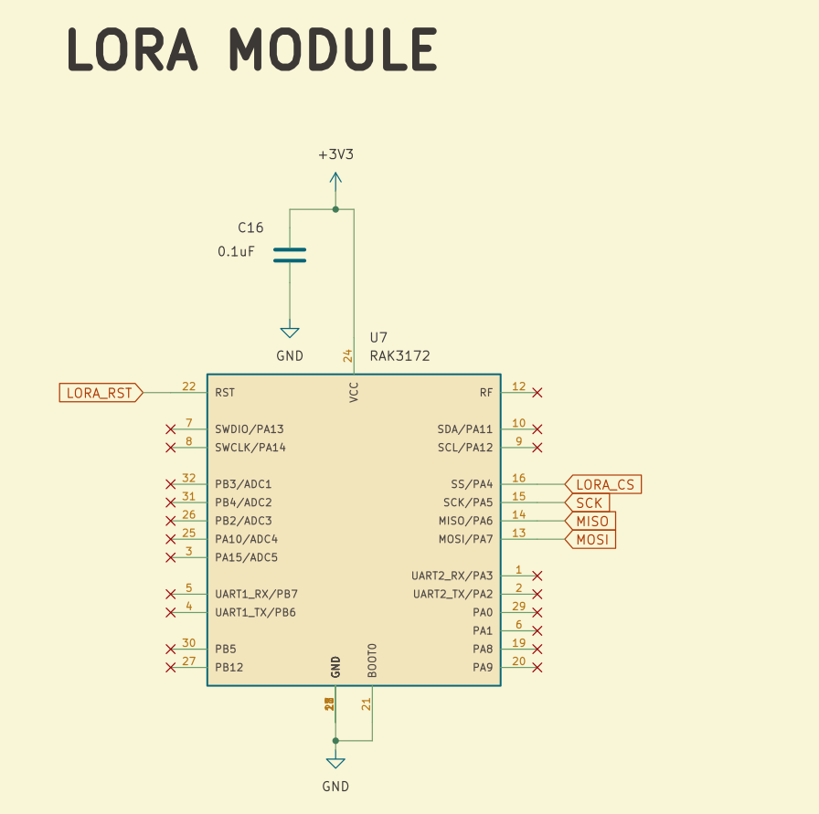

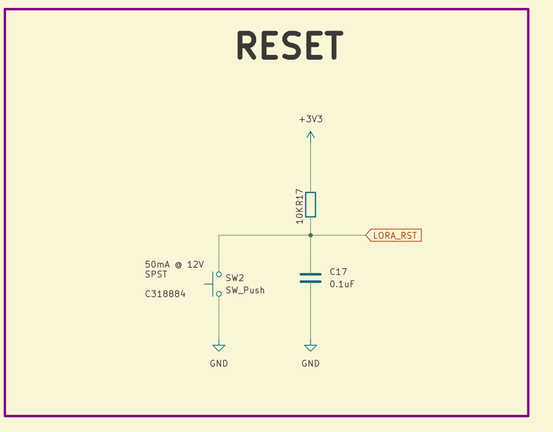

### **WMBUS RC-S2LP CIRCUIT**

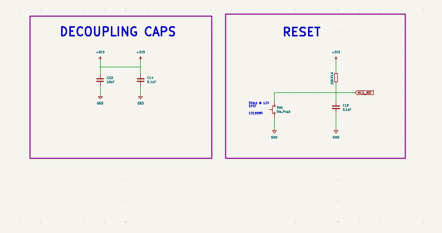

### **USB-C AND BATTERY CONNECTOR**

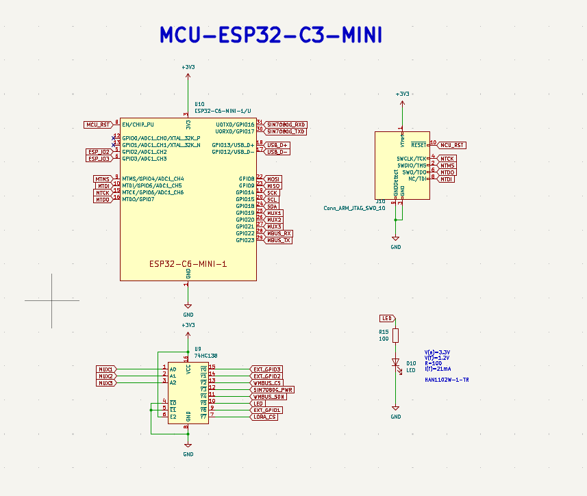

### **POWER CONVERSION CIRCUIT**

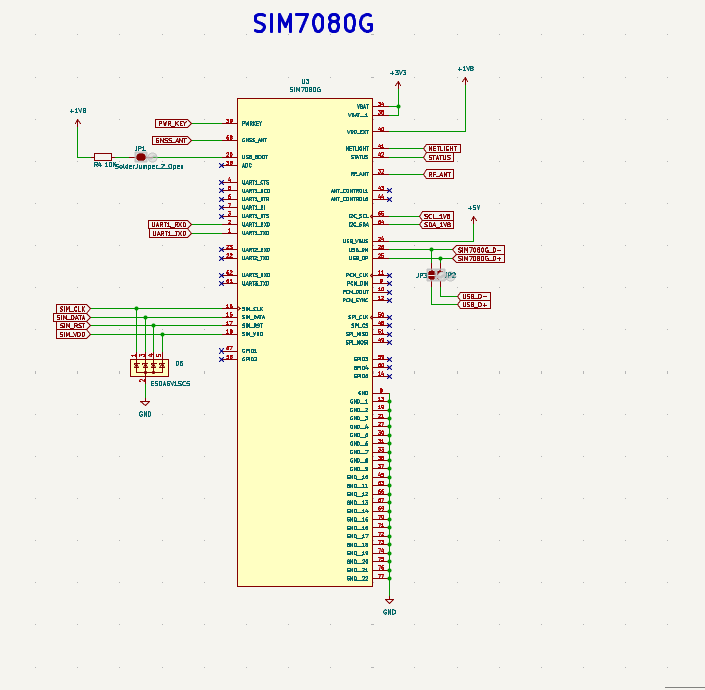

### **RESISTOR AND CAPACITOR SPECS**

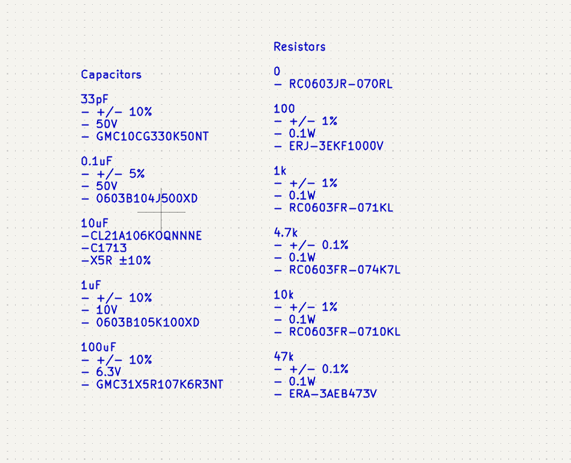

### **BOARD FRAME AND HEADER PINS**

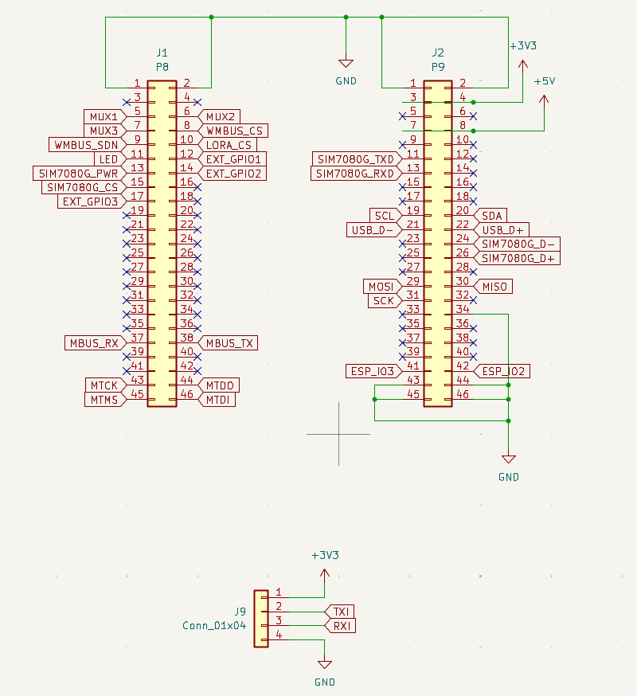
