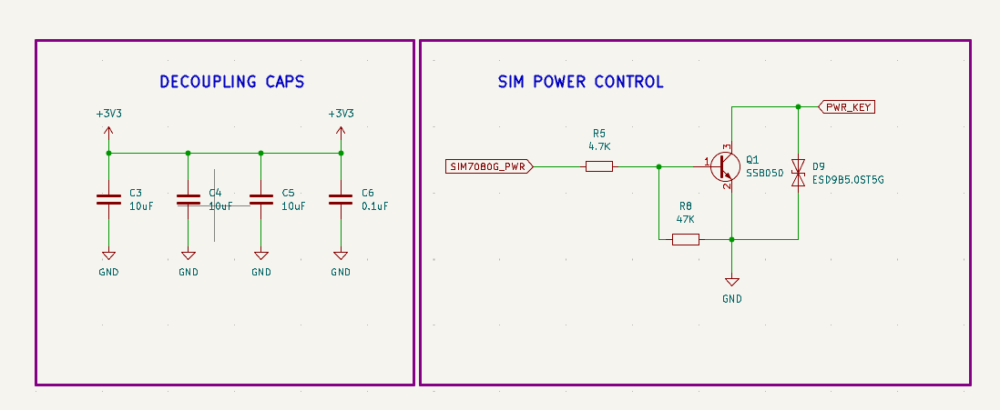
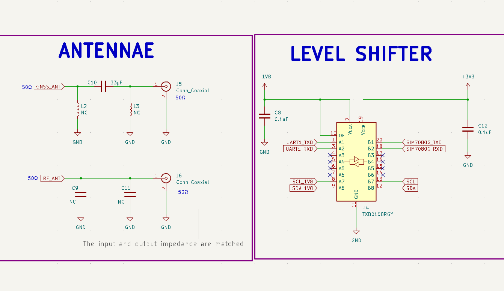
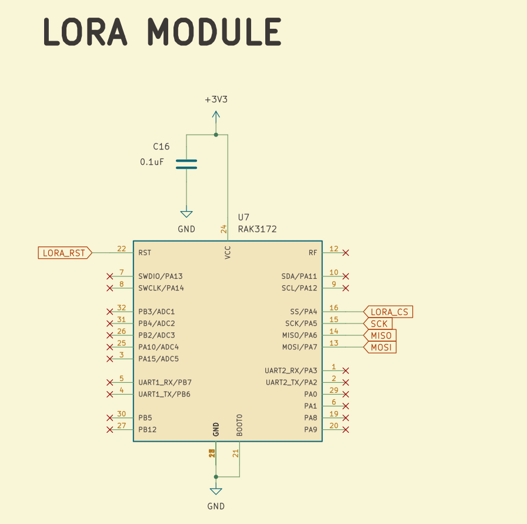
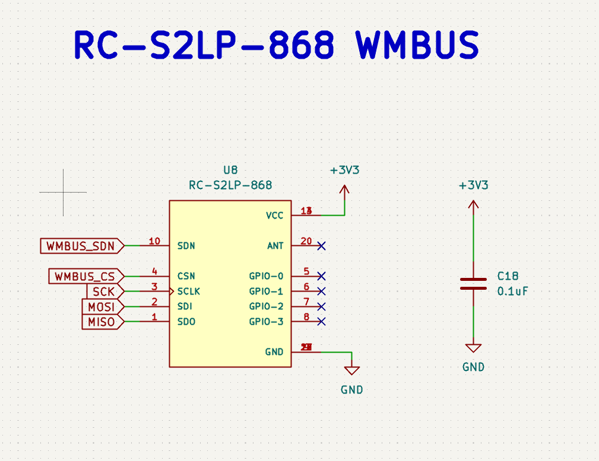
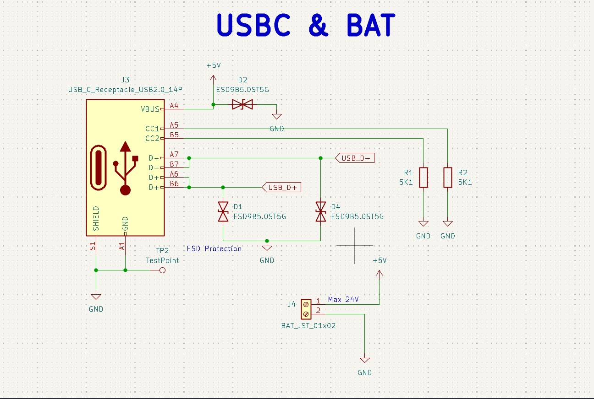
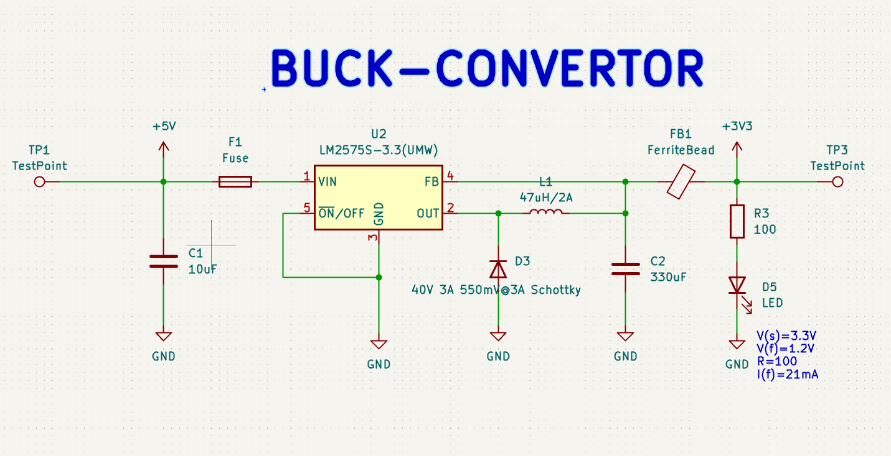
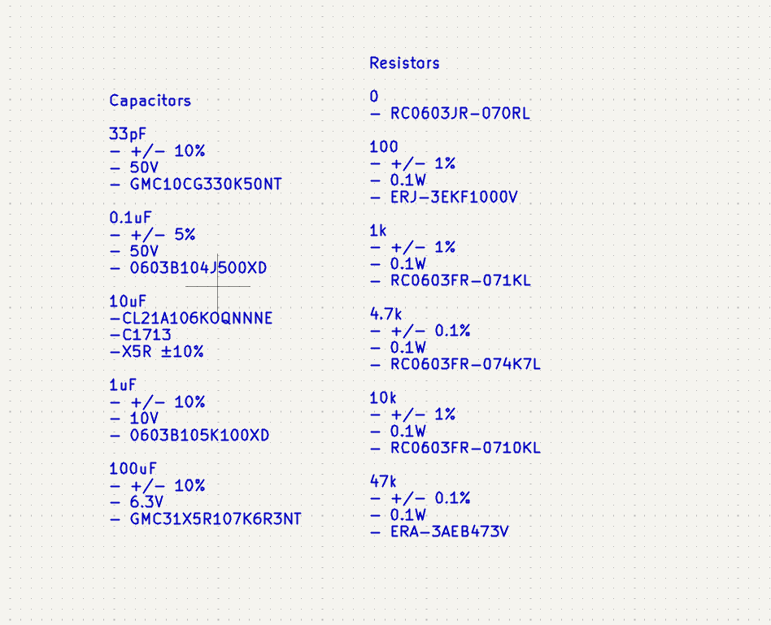
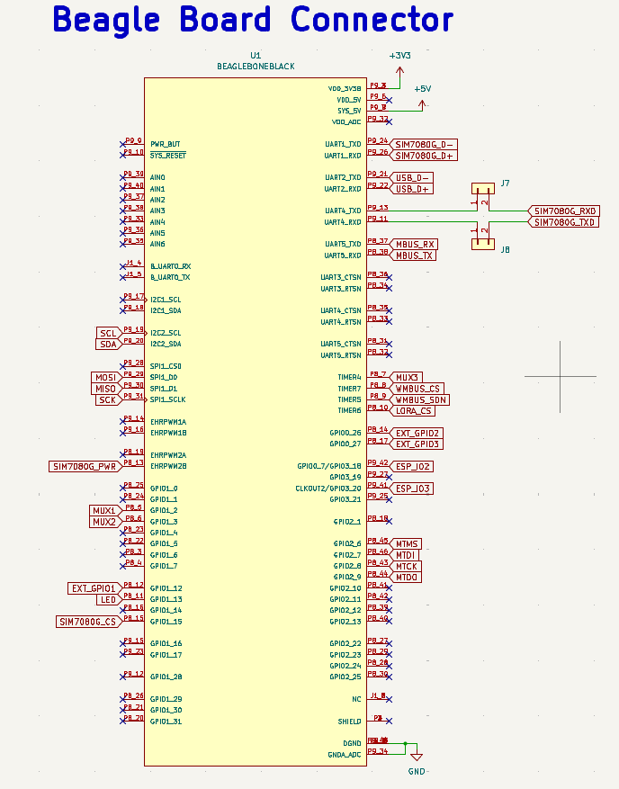
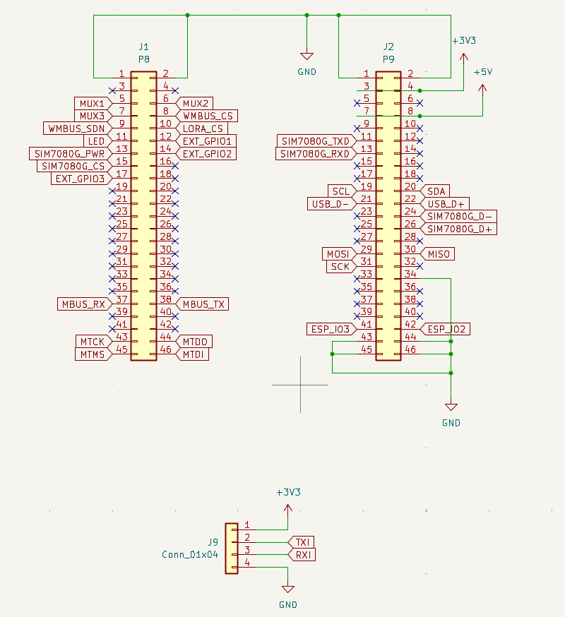

# 📡 S0 Board Architecture and Schematics

## **HARDWARE ARCHITECTURE**

### **ESP32 CIRCUIT**

### **SIM7080G CIRCUIT**

### **RAK 3172 LORA MODULE**

### **RC-S2LP CIRCUIT**

### **USB-C AND BATTERY CONNECTOR**

### **POWER CONVERSION CIRCUIT**

### **RESISTOR AND CAPACITOR SPECS**

### **BOARD FRAME AND HEADER PINS**

