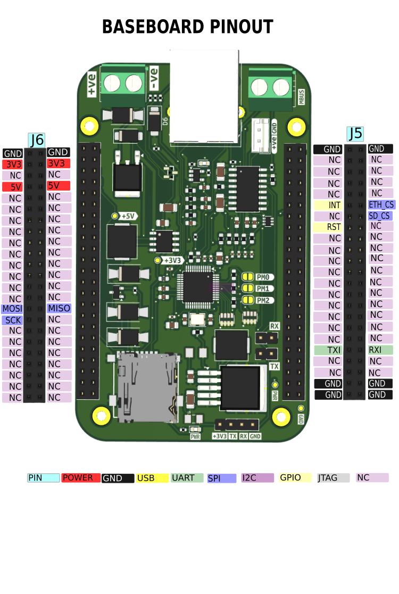

# **Baseboard Pinouts**

## DC header pinout (`J6`)

| Pin      | Name | Description                 |
| -------- | ---- | --------------------------- |
| 1D, 1C   | GND  | Ground                      |
| 2D, 2C   | 3V3  | 3.3V output                 |
| 3D, 3C   | -    | Unused Pins                 |
| 4D, 4C   | 5V   | 5V output                   |
| 5 -- 14  | -    | Unused Pins                 |
| 15D      | MOSI | Ethernet MOSI, SD CARD MOSI |
| 15C      | MISO | Ethernet MISO, SD CARD MISO |
| 16D      | SCK  | Ethernet SCK, SD CARD SCK   |
| 17 -- 23 | -    | Unused Pins                 |

## DC header pinout (`J5`)

| Pin      | Name | Description              |
| -------- | ---- | ------------------------ |
| 1B, 1A   | GND  | Ground                   |
| 2 - 5    | -    | Unused pins              |
| 6B       | INT  | Ethernet Interrupt Pin   |
| 6A       | CS   | Ethernet SPI Chip Select |
| 7A       | CS   | SD Card Chip Select      |
| 7B, 8A   | -    | Unused pins              |
| 8B       | RST  | Ethernet Reset Pin       |
| 9 -- 18  | -    | Unused                   |
| 19B      | TXI  | M-Bus Data Out           |
| 19A      | RXI  | M-Bus Data In            |
| 20 -- 21 | -    | Unused Pins              |
| 22 -- 23 | GND  | GND                      |

