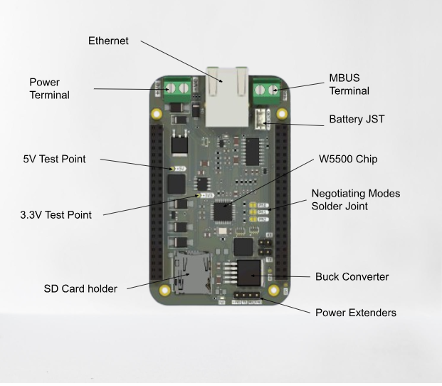

# **Baseboard Start Up**

## **Powering the Board.**

The Baseboard is powered by a 24V max DC power supply . The power supply is connected to the board via the Power Screw Terminal with polarity as marked on the board. Incase of reverse polarity connection the board has Reverse Polarity Protection enabled as well as Overcurrent Protection in cases of Short Circuiting.

The Baseboard can also be powered by a battery of 7.4V and the connection done via the Battery JST connector.

## **Testing Power.**

Power supply to the board is converted to 5V and 3.3V by the BUck Converter and 3.3V Regulator. To test the power supply, connect a multimeter and measure the voltage at the 5V and 3.3V test points as labelled on the board.

## **Ethernet.**

The Baseboard has an onboard Ethernet port which can be used to connect to the internet. This is made possible by the W5500 Chip that has Auto Negotiating modes which can be configured via the Solder joints labelled on the board.
Negotiation of Speed and Connection type can be Full or Half Duplex through these pins.
You can set:

- 10 Mbps Half-Duplex
- 10 Mbps Full-Duplex
- 100 Mbps Half-Duplex
- 100 Mbps Full-Duplex

## **Wired Meter Bus.**

The Baseboard has a Wired Meter Bus which is a 2 wire interface that can be used to connect to the Wired Meter. The Wired Meter Bus is connected to the Wired Meter via the MBus Screw Terminal with its markings as shown on the board.

## **Data Storage Feature.**

The Baseboard is also equipped with a MicroSD card slot which can be used to store MBUS data to an SD Card.

## **How to use the Baseboard.**

The Baseboard is meant to be used together with the S0 board. The S0 board acts like a cape to the Baseboard and is powered directly by the Baseboard. This connection is done by the 2x23 male headers on the S0 fitting onto the female headers of the Baseboard.
