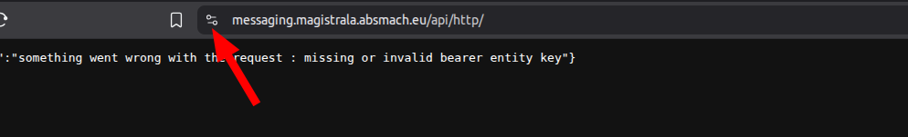
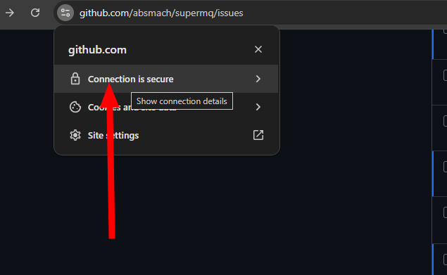
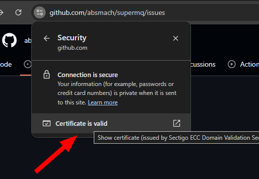
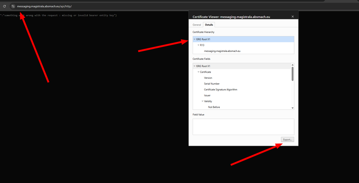

# **Connecting S0 to Magistrala via MQTTS**

## **Running Magistrala**

Ensure that Magistrala is running.

Ensure also you are in the `embedded/targets/zephyr/mqtts` directory when executing the below steps

Modify the configuration file in `src/config.h`

Start with the WiFi credentials as S0 in this case is in Station Mode.

```code
#define WIFI_SSID "SSID"    // Replace `SSID` with WiFi ssid
#define WIFI_PSK "PASSWORD" // Replace `PASSWORD` with Router password
```

## **Configuring Magistrala variables**

## **Standard TLS**

```code
/* Magistrala Configuration */
#define MAGISTRALA_HOSTNAME "messaging.magistrala.absmach.eu" // Replace with your Magistrala instance hostname or IP
#define MAGISTRALA_MQTTS_PORT 8883
#define DOMAIN_ID "DOMAIN_ID"         // Replace with your Domain ID
#define CLIENT_ID "CLIENT_ID"         // Replace with your Client ID
#define CLIENT_SECRET "CLIENT_SECRET" // Replace with your Client secret
#define CHANNEL_ID "CHANNEL_ID"       // Replace with your Channel ID
```

## **TLS Certificate**

Update `src/ca_cert.h` with [Magistrala CA certificate](https://messaging.magistrala.absmach.eu/api/http/).

## **How to get the certificate**

After navigating to the link [Magistrala CA certificate](https://messaging.magistrala.absmach.eu/api/http/), follow the below images to acquire the certificate.

### Step 1



### Step 2



### Step 3



### Step 4

Click on export to download the certificate.



### Step 5

Update `src/ca_cert.h` with the downladed certificate contents.

## **Bulding and Flashing Code**

Once you update the configuration file, build and run the code:

```bash
west build -p always -b esp32c6_devkitc
west flash
west espressif monitor
```

To monitor Magistrala mqtts messages, check in Messages under Clients Management.


---
