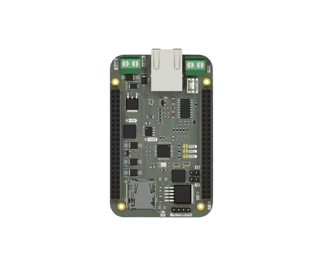

# 📘 S0 BaseBoard

## 🔧 Features

- Onboard **W5500 Ethernet controller** for wired Ethernet connectivity
- **TSS721A transceiver** for M-Bus communication
- Wired M-Bus connection via Screw Terminal (`J1`)
- SD Card slot for data logging
- Dual 2×23-pin vertical pin sockets (`J5`, `J6`) for connecting the S0 board
- 24V maximum input via Screw Terminal (`J2`)
- Battery input and onboard charging circuit via JST connector (`J3`)
- SPI and UART routed through `J5`/`J6` to communicate with the S0 board
- Protection components: diodes, inductors, capacitors for power and signal integrity
- Modular and expandable design with solder jumpers for configuration

---

## 🔌 Connector Overview

| Reference | Type                             | Description                   |
| --------- | -------------------------------- | ----------------------------- |
| `J2`      | JST Connector                    | 24V DC Power Input            |
| `J3`      | JST Connector                    | Battery Input and Charging    |
| `J5`      | 2×23 Pin Female Header (2.54 mm) | Main S0 interface (SPI, UART) |
| `J6`      | 2×23 Pin Female Header (2.54 mm) | Secondary interface to S0     |
| `JP2`     | Solder Jumper                    | Config option for W5500       |
| `JP3`     | Solder Jumper                    | Config option for W5500       |

---

## ⚡ Power System

- **Primary Power Input:** 24V via `J2`
- **Battery Backup:** Via `J3` with charger IC circuit
- **Protection:** Diodes for reverse polarity, inductors for EMI
- **Power Output:** Supplies the connected S0 board through headers

---

## 🌐 Communication Interfaces

- **W5500 Ethernet Controller:**
  - Provides wired network connectivity
  - Communicates with the S0 via **SPI**
- **TSS721A Transceiver:**
  - M-Bus driver for utility metering
  - Communicates with the S0 via **UART**
- **Header Connections:**
  - All SPI and UART pins routed to `J5` and `J6`

---

## 🧠 Architecture

The **S0 BaseBoard** serves as a **cape** that powers and extends the S0 module by offering:

- Ethernet via W5500
- Wired M-Bus via TSS721A
- Power management and regulation
- Standard pin headers for seamless plug-on support

---

## 📐 PCB Layout

- 2-layer board with copper on F.Cu and B.Cu
- Board thickness: ~1.6 mm (standard FR-4)
- Modular footprint with JST and pin headers

---

## 🧩 Applications

- Smart grid and smart metering infrastructure
- Industrial IoT gateway
- Prototyping platform for M-Bus over Ethernet
- Expansion base for S0 compute module

---

## 🔄 Interface Map to S0

| Interface | Direction      | Connected To  |
| --------- | -------------- | ------------- |
| SPI       | S0 ↔ W5500     | Network Comm  |
| UART      | S0 ↔ TSS721A   | M-Bus Comm    |
| Power     | BaseBoard → S0 | 5V or Battery |
