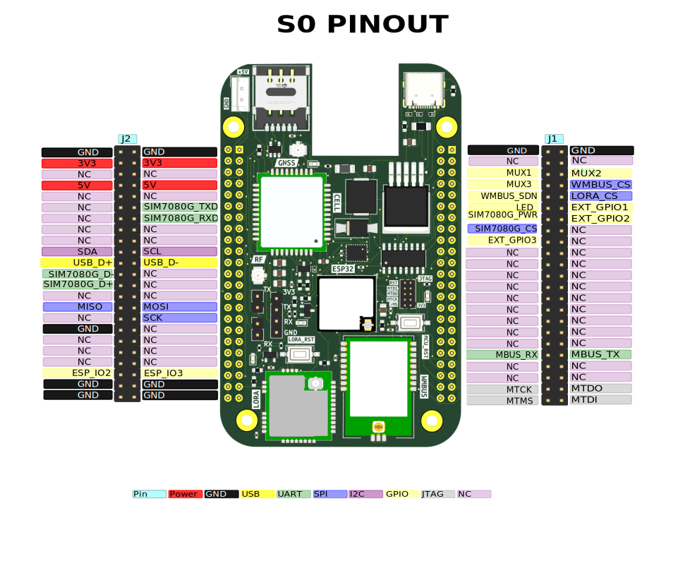

# **S0 PINOUT**

## **BA Header Pinout (`J1`)**

| Pin     | Name          | Description                         |
| ------- | ------------- | ----------------------------------- |
| 1B, 1A  | GND           | Ground                              |
| 2B, 2A  | -             | Unused Pins                         |
| 3B      | SIM7080G_D+   | SIM7080G Data +                     |
| 3A      | SIM7080G_D-   | SIM7080G Data -                     |
| 4B      | ETH_RST       | Ethernet Reset pin                  |
| 4A      | WMBUS_CS      | WMBUS Chip Select                   |
| 5B      | ETH_INT       | Ethernet Interrupt pin              |
| 5A      | ESP_IO8       | External GPIO                       |
| 6B      | -             | Unused Pins                         |
| 6A      | ESP_IO19      | External GPIO                       |
| 7B      | SIM7080G_PWR  | SIM7080G Power Control              |
| 7A      | ESP_IO15      | External GPIO                       |
| 8 - 18  | -             | Unused Pins                         |
| 19B     | MBUS-RX       | MBUS Receiver Pin                   |
| 19A     | MBUS-TX       | MBUS Transmitter Pin                |
| 20 - 21 | -             | Unused Pins                         |
| 22B     | MTCK / ETH_CS | Debug Clock / Ethernet Chip Select  |
| 22A     | MTDO / SD_CS  | Debug Data Out / SD Cardchip select |
| 23B     | MTMS          | Debug Mode Select                   |
| 23A     | MTDI          | Debug Data In                       |

## **DC Header Pinout (`J2`)**

| Pin      | Name         | Description       |
| -------- | ------------ | ----------------- |
| 1D, 1C   | GND          | Ground            |
| 2D, 2C   | 3V3          | 3V3 Input/Output  |
| 3D, 3C   | -            | Unusued Pins      |
| 4D, 4C   | 5V           | 5V Input/Output   |
| 5D, 5C   | -            | Unused Pins       |
| 6D       | SIM7080G_TXD | SIM7080G Transmit |
| 6C       | -            | Unused Pins       |
| 7D       | SIM7080G_TXD | SIM7080G Receive  |
| 8 - 9    | -            | Unused Pins       |
| 10D      | SCL          | I2C Clock Pin     |
| 10C      | SDA          | I2C Data Pin      |
| 11D      | USB_D-       | Flash/Debug ESP   |
| 11C      | USB_D+       | Flash/Debug ESP   |
| 12D      | -            | Unused Pin        |
| 12C      | SIM7080G_D-  | SIM7080G Data -   |
| 13D      | -            | Unused Pin        |
| 13C      | SIM7080G_D+  | SIM7080G Data +   |
| 14D, 14C | -            | Unused Pins       |
| 15D      | MOSI         | SPI MOSI          |
| 15C      | MISO         | SPI MISO          |
| 16D      | SCK          | SPI Serial Clock  |
| 16C      | -            | Unused Pin        |
| 17D      | -            | Unused Pin        |
| 17C      | GND          | Ground Pin        |
| 18 - 20  | -            | Unused Pins       |
| 21D      | ESP_IO1      | GPIO              |
| 21C      | ESP_IO0      | GPIO              |
| 22 - 23  | GND          | Ground Pins       |

