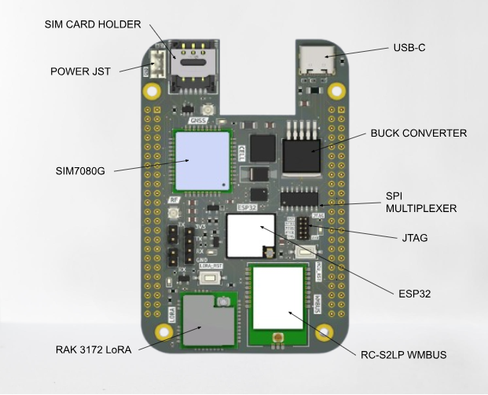

# **How do i start the S0?**

## **Powering the Board**

S0 board ban be powered in 3 ways:

- **USB-C**: The board can be powered via the USB-C port. This method is for development and testing.
- **Battery**: The board can be powered by a battery of maximum 7.4V connected via the battery JST as labelled on the board.
- **Baseboard**: The board can be powered via the baseboard. S0 is connected on top of the Baseboard thereby acting like a Cape. THe Baseboard supplies both 5V and 3.3V to the S0 board.

## **Flashing of Firmware**

The S0 board has the ESP32 C6 as its main microcontroller which can be programmed using any framework of your choice. The firmware is flashed through the USB-C connecter.

Debug can also be done not only through the USB -C connector but also the JTAG pins as labelled on the board with its pinouts. This enables debugging both on-site and off-site.

## **Wieless Communication**

- **WiFi/BLE**: S0 board has ESP32 C6 that is 2.4GHz Wi-Fi and BLE enabled. Antenna connection is made possible by an IPEX connector on the ESP32 C6 with a 2.4GHz antenna of your choice.

- **LoRA**: S0 board has a LoRA module, RAK-3172 that can be used for long range wireless communication. Antenna connection is made possible by an IPEX connector on the RAK-3172 with a 868MHz antenna of your choice.

- **Wireless Meter Bus**: S0 board has a wireless meter bus module, the RC-S2LP, that can be used for wireless communication with WMBUS Meters. Antenna connection is made possible by an IPEX connector on the RC-S2LP with a 868MHz antenna of your choice.

- **NB IoT/ LTE**: S0 board has a NB-IoT/LTE module, the SIM7080G, that can be used for wireless communication with NB-IoT devices. The module has two separate antenna connections namely RF and GNSS whose IPEX connectors are marked on the board. The RF antenna is used for wireless communication while the GNSS antenna is used for GPS. The SIM7080G can be programmed by the ESP32 by sending AT commands through your firmware.
  