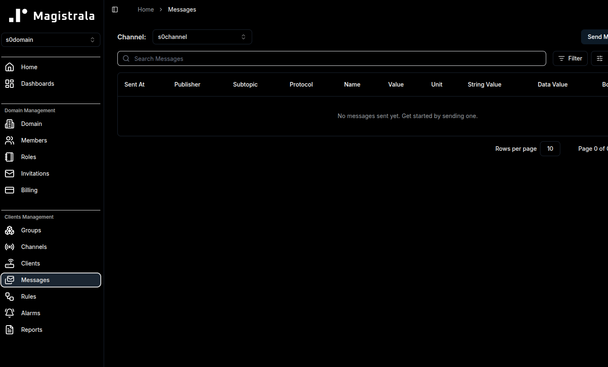

# **Connecting S0 to Magistrala via WebSockets**

## **Running Magistrala**

Ensure that Magistrala is running in your browser.

Ensure also you are in the `embedded/targets/zephyr/websocket` directory when executing the below steps

Modify the configuration file in `src/config.h`

Start with the WiFi credentials as S0 in this case is in Station Mode.

```code
#define WIFI_SSID "SSID"    // Replace `SSID` with WiFi ssid
#define WIFI_PSK "PASSWORD" // Replace `PASSWORD` with Router password
```

## **Configuring Magistrala variables**

```code
#define MAGISTRALA_IP                                                          \
  "MAGISTRALA_IP" // Replace with your Magistrala instance IP
#define MAGISTRALA_WS_PORT 8186
#define DOMAIN_ID "DOMAIN_ID"         // Replace with your Domain ID
#define CLIENT_ID "CLIENT_ID"         // Replace with your Client ID
#define CLIENT_SECRET "CLIENT_SECRET" // Replace with your Client secret
#define CHANNEL_ID "CHANNEL_ID"       // Replace with your Channel ID
```

The `MAGISTRALA_IP` is the IP of your PC running Magistrala. Use the command `ip a` in your terminal to find it.

## Bulding and Flashing Code

Once you update the configuration file, build and run the code:

```bash
west build -p always -b esp32c6_devkitc
west flash
west espressif monitor
```

To monitor Magistrala websocket messages, check in Messages under Clients Management.



---
